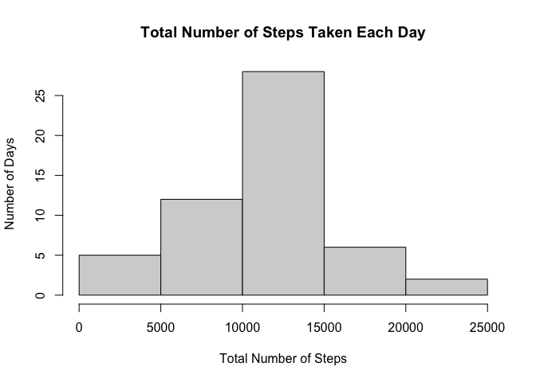
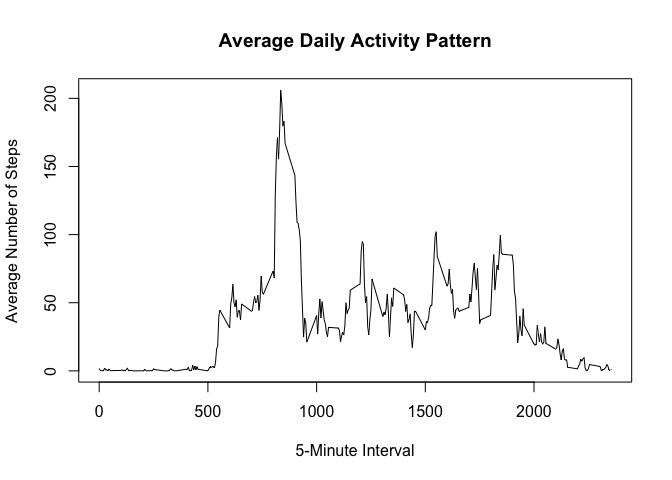
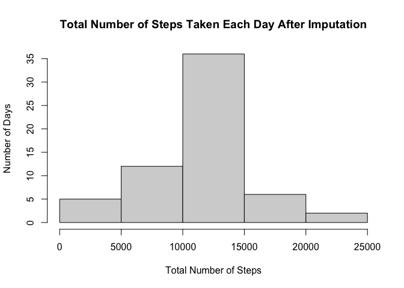
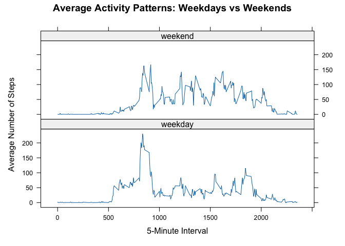

## Loading and preprocessing the data

``` r
activity <- read.csv("activity.csv")
```

``` r
head(activity)
```

```
##   steps       date interval
## 1    NA 2012-10-01        0
## 2    NA 2012-10-01        5
## 3    NA 2012-10-01       10
## 4    NA 2012-10-01       15
## 5    NA 2012-10-01       20
## 6    NA 2012-10-01       25
```

``` r
nrow(activity)
```

```
## [1] 17568
```
## What is mean total number of steps taken per day?

``` r
dailySteps <- aggregate(steps ~ date,
                         data = activity,
                         sum,
                         na.rm = TRUE)
```

``` r
head(dailySteps)
```

```
##         date steps
## 1 2012-10-02   126
## 2 2012-10-03 11352
## 3 2012-10-04 12116
## 4 2012-10-05 13294
## 5 2012-10-06 15420
## 6 2012-10-07 11015
```

``` r
hist(dailySteps$steps,
     main = "Total Number of Steps Taken Each Day",
     xlab = "Total Number of Steps",
     ylab = "Number of Days")
```

<!-- -->

``` r
mean(dailySteps$steps)
```

```
## [1] 10766.19
```

``` r
median(dailySteps$steps)
```

```
## [1] 10765
```
The mean total number of steps taken per day is 10,766.19, while the median is 10,765 steps.

## What is the average daily activity pattern?

``` r
intervalSteps <- aggregate(steps ~ interval,
                           data = activity,
                           mean,
                           na.rm = TRUE)
```

``` r
plot(intervalSteps$interval,
     intervalSteps$steps,
     type = "l",
     xlab = "5-Minute Interval",
     ylab = "Average Number of Steps",
     main = "Average Daily Activity Pattern")
```

<!-- -->

``` r
intervalSteps[which.max(intervalSteps$steps), ]
```

```
##     interval    steps
## 104      835 206.1698
```
The 5-minute interval with the maximum average number of steps is interval 835, corresponding to the period from 8:35 AM to 8:40 AM.

## Imputing missing values

``` r
sum(is.na(activity$steps))
```

```
## [1] 2304
```
There are 2,304 missing values in the steps variable.

To impute the missing values, I used the mean number of steps for the corresponding 5-minute interval across all days. This strategy uses the typical activity level for that particular time of day to replace missing observations.


``` r
activity_imputed <- activity
```

``` r
for (i in 1:nrow(activity_imputed)) {
    if (is.na(activity_imputed$steps[i])) {
        activity_imputed$steps[i] <-
            intervalSteps$steps[
                intervalSteps$interval == activity_imputed$interval[i]
            ]
    }
}
```

``` r
sum(is.na(activity_imputed$steps))
```

```
## [1] 0
```

``` r
dailySteps_imputed <- aggregate(steps ~ date,
                                data = activity_imputed,
                                sum)
```

``` r
hist(dailySteps_imputed$steps,
     main = "Total Number of Steps Taken Each Day After Imputation",
     xlab = "Total Number of Steps",
     ylab = "Number of Days")
```

<!-- -->

``` r
mean(dailySteps_imputed$steps)
```

```
## [1] 10766.19
```

``` r
median(dailySteps_imputed$steps)
```

```
## [1] 10766.19
```
After imputing the missing values, the mean total number of steps per day remained 10,766.19, while the median increased slightly from 10,765 to 10,766.19. Therefore, the imputation had very little effect on the overall estimates of daily activity.

## Are there differences in activity patterns between weekdays and weekends?

``` r
activity_imputed$date <- as.Date(activity_imputed$date)
```

``` r
activity_imputed$dayType <- ifelse(
    weekdays(activity_imputed$date) %in% c("Saturday", "Sunday"),
    "weekend",
    "weekday"
)
```

``` r
activity_imputed$dayType <- factor(activity_imputed$dayType)
```

``` r
table(activity_imputed$dayType)
```

```
## 
## weekday weekend 
##   12960    4608
```

``` r
weekendWeekday <- aggregate(steps ~ interval + dayType,
                             data = activity_imputed,
                             mean)
```

``` r
head(weekendWeekday)
```

```
##   interval dayType      steps
## 1        0 weekday 2.25115304
## 2        5 weekday 0.44528302
## 3       10 weekday 0.17316562
## 4       15 weekday 0.19790356
## 5       20 weekday 0.09895178
## 6       25 weekday 1.59035639
```

``` r
library(lattice)
```

``` r
xyplot(steps ~ interval | dayType,
       data = weekendWeekday,
       type = "l",
       layout = c(1, 2),
       xlab = "5-Minute Interval",
       ylab = "Average Number of Steps",
       main = "Average Activity Patterns: Weekdays vs Weekends")
```

<!-- -->
There are differences in activity patterns between weekdays and weekends. Weekday activity has a more pronounced peak earlier in the day, followed by relatively lower activity, while weekend activity shows more consistent fluctuations throughout the day.
